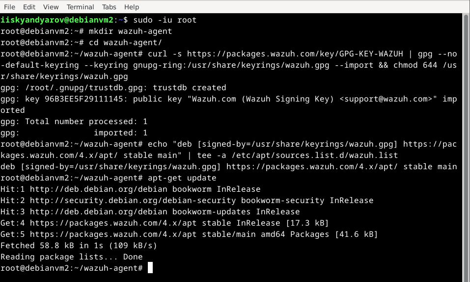
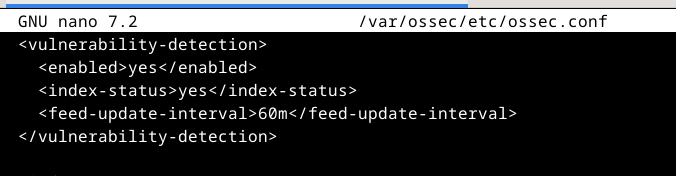

# Практическая работа №3. Wazuh

## Подготовка стенда, создание виртуальных машин, сетевая связность

## Установка сервера Wazuh

## Установка агента Wazuh

## Подключенный агент в дашборде

## Настройка проверки целостности файлов

### Изменение файла `test1`

### Срабатывание правила

## Настройка проверки уязвимостей

## Настройка выявления скрытых процессов

### Установка необходимых пакетов

### Настройка мониторинга процессов в агенте Wazuh

### Сборка и запуск руткита

### Срабатывание правила

## Настройка выявления SQL-инъекций

### Установка веб-сервера Apache

### Конфигурация мониторинга логов Apache

### Демонстрационная атака

### Срабатывание правила

## Проверка выявления атаки Shellshock

