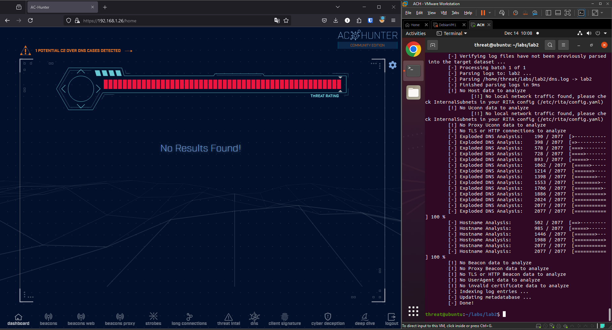

# Практическая работа №4. Network Threat Hunting

## Развёрнутый стенд

## Первое задание, импорт логов

## Информация о подключениях

Большинство подключений осуществялось к сервисам microsoft, одно подключение является подозрительным.

### Добавление легитимных узлов в Safelist

При добавлении узлов в Safelist можно воспользоваться добавлением по шаблону и добавить сразу любые поддомены конкретного домена.

### Анализ HTTP-логов

## Задание 2, импорт логов

### Анализ DNS-запросов

Большое количество DNS-запросов к домену `honestimnotevil.com`, а также поддоменам в виде хекса. Эти подключения могли использоваться для осуществления C2 через DNS.

## Задание 3, импорт логов

Обращения к домену `skypetm.com.tw`, который не является реальным доменом Skype. Также, запись User-Agent не является валидной.

Подключение можно считать вредоносным, в чем можно также убедиться через VirusTotal.

