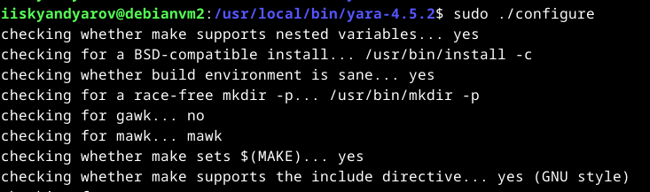

# Практическая работа №5. Threat Hunting

Для работы были использованы уже ранее созданные в [ПРЗ №3](../prz3/) стенды Wazuh.

## Установка и настройка IDS Suricata

Установка Suricata из репозитория:

Загрузка правил обнаружения:

Настройка импорта логов Suricata в Wazuh и перезапуск агента:

## Установка и настройка Yara

### Настройка агента

Загрузка и распаковка дистрибутива:

Установка Yara:

Загрузка YARA-правил:

Создание скрипта `yara.sh` для Wazuh и настройка владельца и прав на скрипт:

Настройка правил мониторинга в файле `/var/ossec/etc/ossec.conf`, перезапуск агента:

### Настройка сервера

Настройка правил Wazuh для отслеживания изменений и срабатывания правил YARA:

Настройка декодера результатов сканирования Yara:

Настройка команд Wazuh, который будут запускать сканирование при обнаружении изменений в отслеживаемой директории:

Загрузка вредоносных файлов с помощью скрипта из официальной документации:

Срабатывание Yara:

## Эмуляция атаки

Для проверки Suricata была использована утилита для сканирования хостов `nuclei`:

События Suricata:

